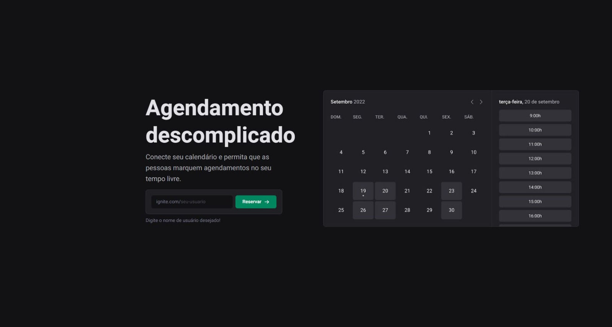
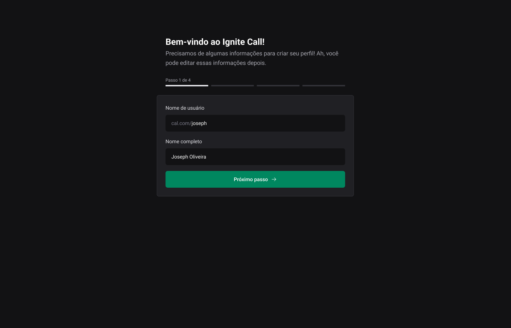
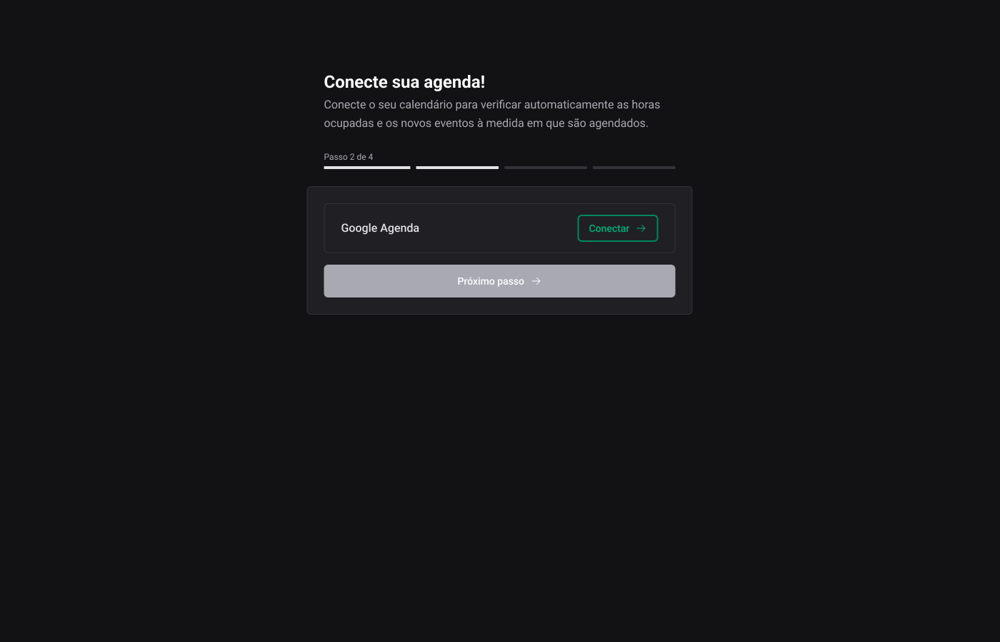
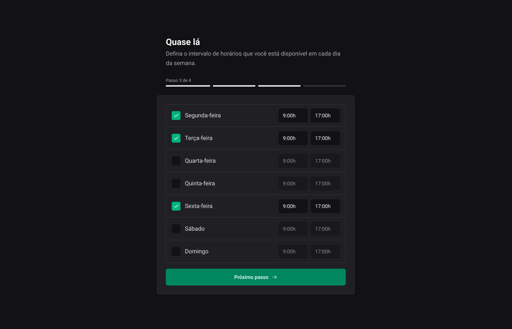
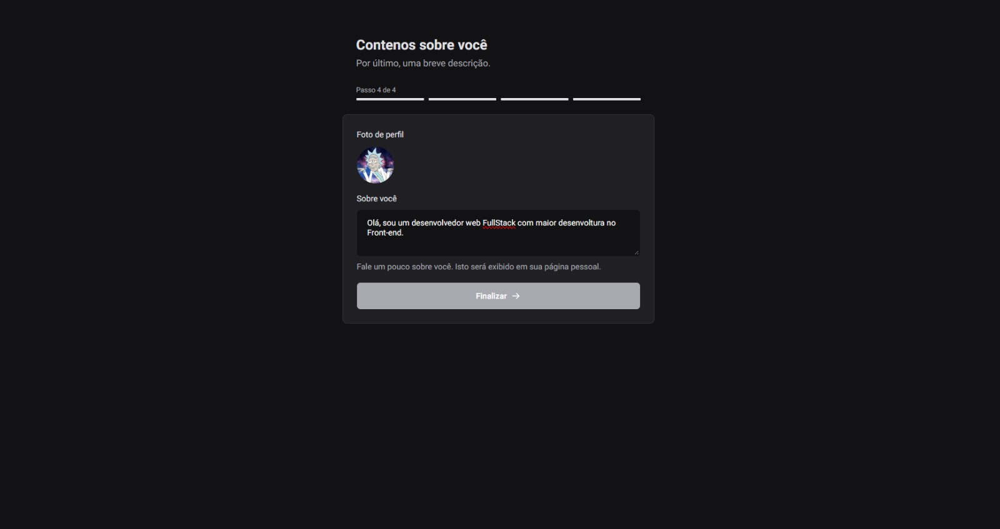
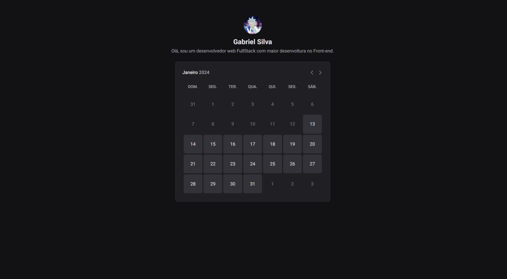
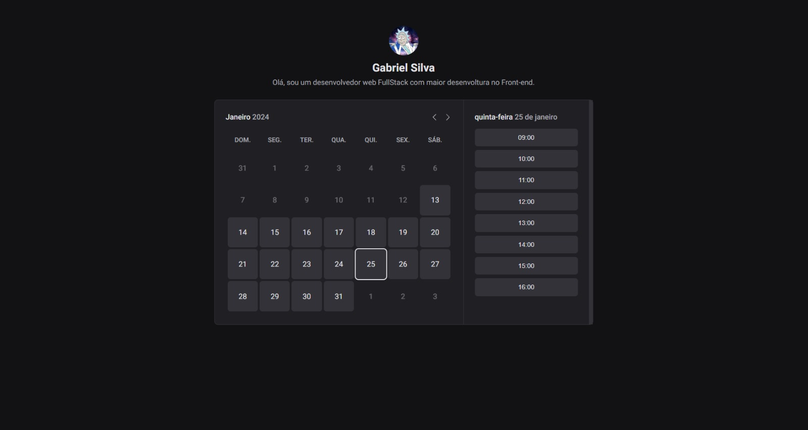
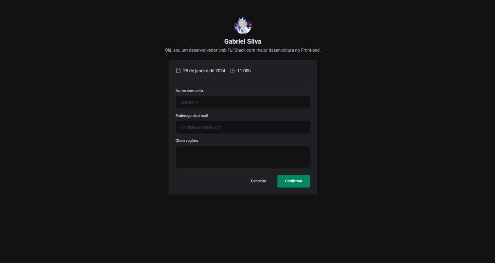

<h1 align='center'>Ignite Call</h1>

## Apresentação do Projeto

Bem-vindo ao IgniteCall! Uma aplicação em React.js para criação de agendamentos integrados com seu calendário pessoal do Google.

## Aprendizado

Ao longo do desenvolvimento deste projeto, pude adquirir conhecimento em várias áreas, incluindo:

- **Rotas Autenticadas com Next.js:** Descobri como implementar rotas autenticadas usando o framework Next.js, proporcionando uma experiência segura para os usuários.

- **Integração com Google Calendar:** Aprendi a integrar a aplicação com o Google Calendar, permitindo que os usuários sincronizem facilmente seus agendamentos.

- **Permissão do Google:** pedir permissão para manipulação no calendario Google.

- **Validações Avançadas:** Explorei técnicas de validação para garantir a integridade e correto funcionamento da aplicação.

- **Deploy da Aplicação:** Fiz o processo completo, desde o desenvolvimento até o deploy, garantindo que a aplicação estivesse pronta para uso em um ambiente de produção.

## Preview do Projeto

